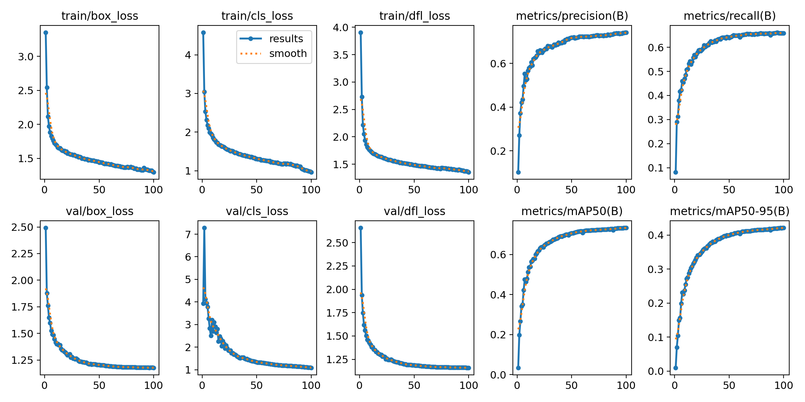

# Fire Detection using YOLOv11

Fire detection is critical for ensuring safety and reducing potential damage in homes, workplaces, and natural environments. Early detection allows for rapid response, which can save lives, protect property, and limit environmental impact. This pipeline, built using YOLOv11 and the D-Fire dataset, is designed to accurately detect fire in real-time, providing a valuable tool for enhancing fire safety and prevention efforts.

---

## Dependenices Installation:
1. Install Anaconda on your Ubuntu system if it already not installed. Refer to the official website [Anaconda Installation](https://docs.anaconda.com/free/anaconda/install/linux/). Open a Terminal Window and run below commands after modifying the installer version
```bash
    sudo apt-get install libgl1-mesa-glx libegl1-mesa libxrandr2 libxrandr2 libxss1 libxcursor1 libxcomposite1 libasound2 libxi6 libxtst6 #Contiue with next commands if some of the libraries fail to install
    curl -O https://repo.anaconda.com/archive/Anaconda3-2024.02-1-Linux-x86_64.sh #Get the version from Anaconda Website
    bash ~/Anaconda3-2024.02-1-Linux-x86_64.sh
```
2. Complete the Installation of Anaconda further by visiting the website and activate conda by below command
```bash
    conda init
```
3. Clone the below repository 
```bash
    cd ..
    git clone https://github.com/vinay06vinay/Fire-Detection-using-YOLOv11.git
```
4. Create a new Conda environment with below dependencies. For Pytorch dependencies based on your system refer to Website [Pytorch](https://pytorch.org/get-started/locally/)
```bash
    conda create --name fire_yolo
    conda activate fire_yolo
    pip install ultralytics
    cd Fire-Detection-using-YOLOv11
```
5. Make sure tensorboard is installed. To run tensorboard once training is finished, use below command
```bash
    tensorboard --logdir runs/
```

--- 

## Dataset Download

If you want to train the yolo model with different hyperparameters or configuration, download the dataset from [D-Fire Dataset](https://github.com/gaiasd/DFireDataset.git) and place it inside the current folder of this repository.


## Training

1. Once the dataset is downloaded along with the required dependencies, maintain the folder structure as shown below:

    ```
    Fire-Detection-using-YOLOv11
    ├── D-Fire
    │   ├── train
    │   │   ├── images
    │   │   └── labels
    │   └── test
    │       ├── images
    │       └── labels
    ├── fire_config.yaml
    ├── train.py
    ├── predict.py
    ├── best.pt
    └── last.pt
    ```

2. Make sure you activate the conda environment before using the commands to train:

    ```bash
    cd Fire-Detection-using-YOLOv11
    python train.py
    ```

3. Refer to `train.py` for different CLI arguments that can be passed. For example:

    ```bash
    python train.py --weights /path/to/last.pt --epochs 100 --batch_size 16
    ```


## Testing/ Prediction

To test using the pre-trained model on the D-Fire dataset, use the weights `best.pt` or `last.pt` from the weights folder for any image or video data.

```bash
# Using command line arguments. Refer to "predict.py" for the full list of options available.
python predict.py --source bus.jpg/fire_test.mp4 --stream True
```

## Results
The result of the fire detection looks something like below. Additionally, find the loss curves and confusion matrix in the runs folder
<p align="center">

</p>

## Performance Metrics

After training the D-Fire dataset for 100 epochs, below are some validation metrics achieved. For detailed graphs/images, refer to `runs/val`.

- **Precision**: 74.22%
- **Recall**: 65.82%
- **mAP50**: 73.36%

<p align="center">

</p>


## References
1. de Venâncio, P.V.A.B., Lisboa, A.C. & Barbosa, A.V. An automatic fire detection system based on deep convolutional neural networks for low-power, resource-constrained devices. Neural Comput & Applic 34, 15349–15368 (2022). https://doi.org/10.1007/s00521-022-07467-z